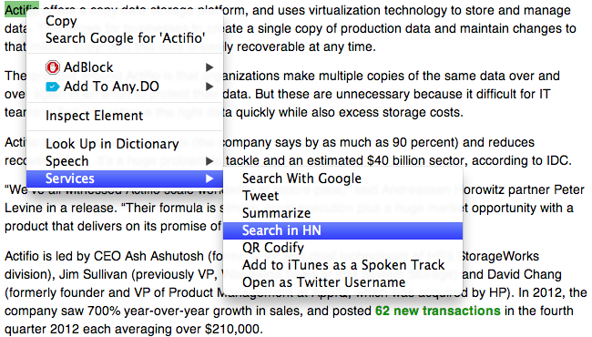

hnsearch
========

Hacker News Search for OSX 
--------------------------

Lately, I find myself using the Search tool of [Hacker News](http://news.ycombinator.com) more and more. Inspired by [QR Codify](http://zacharyvoase.com/2013/03/06/qr-codify/), I decided to write my own script so I can search anything I want on the Hacker News website. If you think that could be useful for you - feel free to try it out. 

Browse the [thread](http://news.ycombinator.com/item?id=5331370) on HN.

Kudos to [Zachary Voase](http://zacharyvoase.com/).

Usage
-----
1. download the hnsearch archive
2. extract and run the .wflow file

